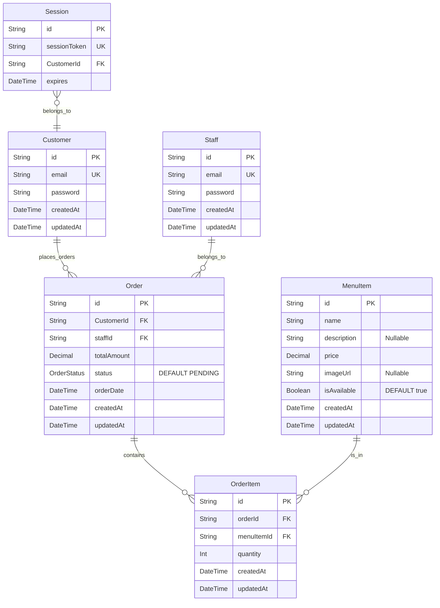

```mermaid
erDiagram
    Customer {
        String id PK
        String email UK
        String password
        DateTime createdAt
        DateTime updatedAt
    }

    Session {
        String id PK
        String sessionToken UK
        String CustomerId FK
        DateTime expires
    }

    MenuItem {
        String id PK
        String name
        String description "Nullable"
        Decimal price
        String imageUrl "Nullable"
        Boolean isAvailable "DEFAULT true"
        DateTime createdAt
        DateTime updatedAt
    }

    Staff {
        String id PK
        String email UK
        String password
        DateTime createdAt
        DateTime updatedAt
    }

    Order {
        String id PK
        String CustomerId FK
        String staffId FK
        Decimal totalAmount
        OrderStatus status "DEFAULT PENDING"
        DateTime orderDate
        DateTime createdAt
        DateTime updatedAt
    }

    OrderItem {
        String id PK
        String orderId FK
        String menuItemId FK
        Int quantity
        DateTime createdAt
        DateTime updatedAt
    }

    Customer ||--o{ Order : "places_orders"

    Session }o--|| Customer : "belongs_to"

    Order ||--o{ OrderItem : "contains"

    MenuItem ||--o{ OrderItem : "is_in"

    Staff ||--o{ Order : "belongs_to"
```
